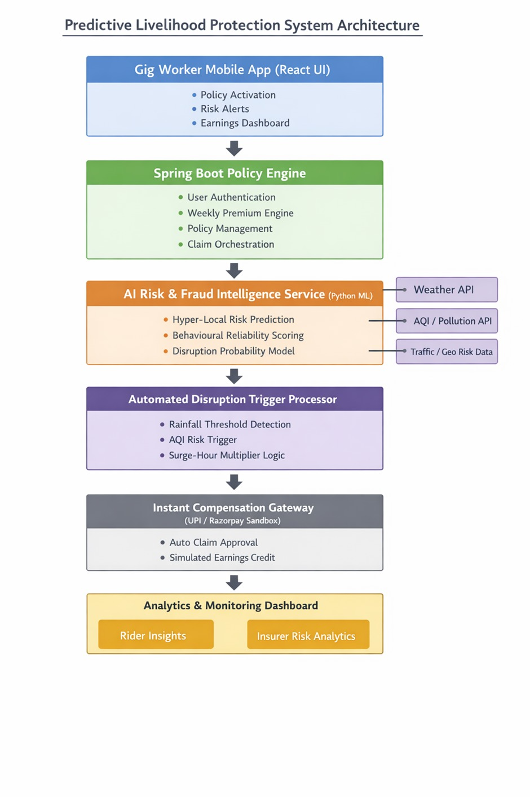

# 🚀 GigGuard AI  
## Predictive Hyper-Local Income Protection Platform for Urban Gig Delivery Workforce  

---

## 🌍 Background & Problem Context  

India’s hyperlocal delivery ecosystem has become a critical pillar of urban commerce.  
Food delivery partners operating on platforms such as **Swiggy** and **Zomato** depend on high-frequency order cycles and surge-hour demand windows to maintain consistent weekly earnings.  

However, localized environmental and civic disruptions such as:

- sudden heavy rainfall clusters  
- flash flooding in low-lying delivery zones  
- extreme heat waves  
- hazardous air pollution spikes  
- unplanned curfews or zone shutdowns  

can instantly halt delivery operations within micro-geographies of a city.  

These uncontrollable disruptions can lead to **20–30% weekly income volatility**, exposing gig workers to livelihood instability due to the absence of tailored short-cycle income protection mechanisms.  

**GigGuard AI** addresses this gap by introducing a **predictive parametric income-protection infrastructure** designed specifically for gig delivery riders.  

---

## 👤 Clearly Defined Persona  
### Primary Persona — Urban Surge-Dependent Delivery Rider  

GigGuard AI focuses on a specific operational segment:  

Urban food delivery riders working in **high-density metropolitan micro-zones** who depend heavily on peak demand earnings.  

### Persona Attributes  

- **Average daily earning:** ₹700 – ₹1200  
- **Income pattern:** Surge-hour concentrated (lunch & dinner peaks)  
- **Operational model:** Multi-zone dynamic routing  
- **Vulnerability:** Short-duration weather or civic disruptions  
- **Financial preference:** Low-commitment weekly micro-protection  

Designing around this persona ensures **context-aware pricing, coverage logic, and user experience simplicity.**  

---

## 💡 Product Vision  

GigGuard AI is conceptualized not merely as an insurance platform but as a  

> **Predictive Livelihood Protection System**  

that stabilizes weekly earning streams of gig workers.  

The platform integrates:

- Hyper-local AI risk intelligence  
- Parametric disruption triggers  
- Behavioural reliability analytics  
- Surge-hour income sensitivity  

This shifts gig insurance from **reactive compensation → proactive resilience engineering.**  

---

## ⚙️ End-to-End Intelligent Workflow  

1. Rider registers and selects delivery operating zone  
2. System maps rider to **Geo-Risk Grid Cluster (2–3 km radius)**  
3. AI engine computes weekly disruption probability score  
4. Platform recommends dynamic micro-insurance premium tier  
5. Continuous real-time environmental monitoring begins  
6. Surge-hour weighted income-loss logic activates  
7. Parametric disruption trigger auto-initiates claim  
8. Instant compensation simulation executed  

This workflow ensures **zero-touch claim experience and rapid financial response.**  

---

## 🗺️ Hyper-Local Geo-Risk Grid Innovation  

GigGuard AI introduces a **Micro-Geospatial Risk Mapping Model**, dividing urban delivery ecosystems into dynamic risk grids.  

Each grid maintains a continuously updated risk index based on:

- localized rainfall intensity data  
- historical flood incidence patterns  
- AQI fluctuation heatmaps  
- traffic congestion analytics  
- disruption-claim density history  

This enables **precision-driven premium pricing and scalable actuarial intelligence.**  

---

## ⏰ Surge-Hour Income Shield (Key Differentiator)  

Delivery earnings are highly concentrated during peak demand windows.  

GigGuard AI incorporates a **Surge-Sensitive Payout Multiplier**:

- baseline disruption payout during normal hours  
- enhanced compensation during peak earning slots  

This aligns financial protection with **real earning psychology of gig workers.**  

---

## 🤖 AI Decision Intelligence Framework  

### Predictive Disruption Risk Model  

Machine learning ensembles (**Gradient Boosted Trees / Random Forest**) analyse:

- rainfall intensity patterns  
- pollution spikes  
- traffic slowdown probability  
- seasonal disruption cycles  
- verified claim behaviour  

**Outputs Generated:**

- weekly premium recommendation  
- disruption probability score  
- rider-zone risk classification  

### Behavioural Reliability Scoring Engine  

GigGuard AI computes a dynamic **Rider Trust Index** using:

- delivery activity consistency  
- anomalous claim patterns  
- GPS validation signals  
- temporal working behaviour  

This enables:

- premium incentives for reliable riders  
- proactive fraud detection  
- long-term financial trust modelling  

---

## 🔔 Predictive Livelihood Alerts  

The platform generates **next-day disruption risk forecasts**, enabling riders to adjust working schedules and reduce potential income shocks.  

GigGuard AI thus becomes a **proactive livelihood advisor**, not just a passive insurance provider.  

---

## 📱 Human-Centric User Experience Philosophy  

- onboarding completion under **60 seconds**  
- weekly **one-tap policy activation**  
- **no manual claim submission**  
- instant payout feedback notifications  
- intuitive earnings protection dashboard  

Ensures high adoption among gig workers with limited financial literacy.  

---

## 🏗️ Predictive Livelihood Protection Architecture  

  

##🏗️ Prototype Technology Architecture
---
Gig Worker Mobile Interface — React
Backend Policy Engine — Spring Boot
AI Risk Prediction Service — Python ML Models
Geo-Risk Processing Layer — Spatial Data Logic
External Data APIs — Weather, AQI, Traffic
Parametric Trigger Engine — Event Detection Logic
Automated Claim Processor — Rule-Based Decision System
Instant Payout Simulation — UPI / Razorpay Sandbox
Analytics Dashboards — Rider & Insurer Insights

---
Gig Worker Mobile App (React)
↓
Policy & Premium Engine (Spring Boot)
↓
AI Risk Intelligence Service (Python ML)
↓
Hyper-Local Geo-Risk Processing
↓
External APIs (Weather | AQI | Traffic)
↓
Parametric Disruption Trigger Engine
↓
Automated Claim Decision System
↓
Instant Payout Gateway (UPI / Razorpay Sandbox)
↓
Dual Analytics Dashboard

---

## 📊 Intelligent Analytics Layer  

### Rider Dashboard  

- weekly earnings protected indicator  
- disruption probability alerts  
- claim payout visibility  
- reliability score tracking  

### Insurer Dashboard  

- geo-risk heatmap visualization  
- claim density trend analysis  
- predictive disruption forecasting  
- actuarial loss ratio insights  

---

## 💰 Sustainable Weekly Micro-Premium Logic  

| Risk Tier | Weekly Premium | Coverage Logic |
|----------|---------------|---------------|
| Low Risk Grid | ₹18 – ₹20 | Standard income coverage |
| Moderate Risk Grid | ₹24 – ₹28 | Enhanced disruption protection |
| High Flood-Prone Grid | ₹32 – ₹38 | Surge-hour payout multiplier |

---

## 📈 Market Opportunity & Scalability Vision  

India’s gig workforce is projected to exceed **20 million participants** within the next decade.  

GigGuard AI can scale into:

- e-commerce logistics workforce  
- quick-commerce grocery fleets  
- urban service gig networks  
- embedded insurance partnerships  

🎯 **Long-term Vision:**  
To establish **India’s first AI-driven gig livelihood resilience infrastructure.**

Youtube link : https://www.youtube.com/watch?v=Jgi2ke6lc5A&t=2s

By Team The Innovators
